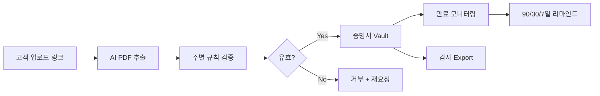
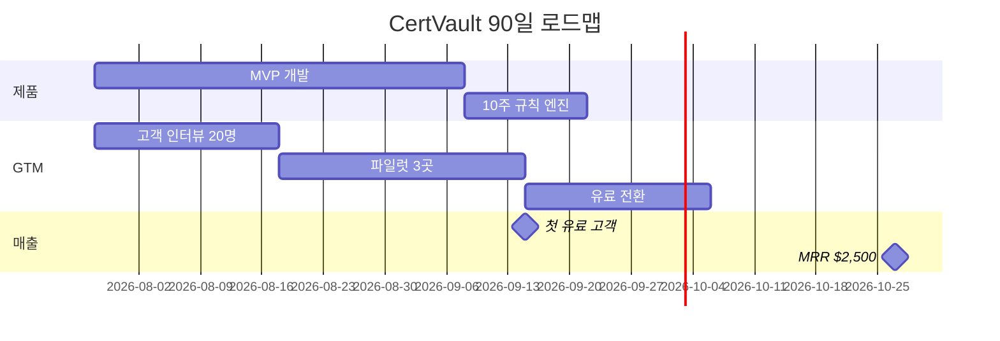

# B2B SaaS 기회 분석: 실제 시장 데이터 기반

> 작성일: 2026-07-27  
> 조사 기준: Reddit, Hacker News, G2, Sikich/Hanover 설문, FDA FSMA 204, 업계 리포트

---

## 조사에서 반복된 패턴

| 출처 | 반복 불만 |
|------|-----------|
| HN #46585643 | billing·support·ops 간 **수동 데이터 조정**이 주간 시간 낭비 1위 |
| Sikich/Hanover (400명 설문) | 면세증명서 관리 **54%가 수동**, 완전 자동화는 **3%** |
| r/ConstructionManagers | COI 추적이 "completely insane and high-risk", 포털 거부 업체는 결국 이메일 |
| NAA 2023 | 50+ 벤더 PM이 COI에 **주당 13시간** |
| Tribble/CSA 2025 | B2B SaaS가 분기당 보안 설문 **8~12건**, 건당 **20~40시간** |
| FDA/FSMA 204 | mock recall 시 **3개 부서·2개 스프레드시트**로 lot 추적 실패 |
| Zero Down/DRS | 화물·3PL 인보이스 **2~8% 과청구**, dispute 기한 30~60일 |

---

## 상위 5개 아이디어

---

### 1. 면세증명서(Exemption Certificate) 수집·검증 SaaS

**한 줄 요약:** B2B 판매사가 면세 고객에게 매출 전에 받아야 하는 주별 면세증명서를 스프레드시트 대신 자동 수집·만료 관리·감사 대응.

| # | 항목 | 내용 |
|---|------|------|
| 1 | 문제 | 면세 거래 시 주별 증명서 없으면 판매사가 세금 부담. 증명서가 이메일·공유드라이브에 흩어져 만료·누락 시 감사 시 **$10,000~$150,000** 과세 위험 |
| 2 | 미해결 이유 | Avalara/Vertex는 대기업용. 중소 B2B는 QuickBooks + Excel. 주마다 양식·유효기간이 달라 범용 AP 툴이 깊게 다루지 않음 |
| 3 | 현재 방식 | Google Drive "W9s (new new)" 폴더 + Excel 추적 + 연말 1099 시즌에 일괄 추적 |
| 4 | 경쟁사 | Avalara ECM, Vertex, ExemptDocs, CertSOLV, AkuCert |
| 5 | 경쟁사 약점 | 엔터프라이즈는 비싸고 도입 3~6개월. ExemptDocs 등 초기 스타트업은 브랜드·통합 부족 |
| 6 | AI 10배 | PDF/스캔에서 법인명·TIN·주·면세유형·만료일 자동 추출 → 주별 규칙 검증 → 만료 90/30/7일 자동 리마인드 |
| 7 | MVP | 고객 업로드 포털 + AI 추출 + 만료 대시보드 + 감사용 ZIP/CSV export |
| 8 | 첫 고객 | Shopify B2B·도매 판매사, 산업자재 유통, 회계사(Tax Twitter, r/taxpros) |
| 9 | 가격 | Starter $99/월(100건), Growth $249/월(500건), Pro $499/월 |
| 10 | 시장 | 미국 판매세 컴플라이언스 SW **$28억(2026)** → $74억(2035), ECM은 그 중 고성장 세그먼트 |
| 11 | 확보 난이도 | 중 — ROI가 명확하나 구매 결정자가 tax/AP |
| 12 | 기술 난이도 | 중 — OCR + 규칙 엔진 + 이메일 워크플로 |
| 13 | AI 난이도 | 중 — 문서 추출은 성숙, 주별 검증 규칙이 핵심 |
| 14 | 개발 기간 | MVP 4~6주 |
| 15 | 초기 비용 | ~20만원(Vercel, Resend, Claude API, 도메인) |
| 16 | 장기 확장 | 캐나다 GST, EU VAT, 호주 GST 면세증명서 |
| 17 | 네트워크 효과 | 약함 |
| 18 | 락인 | 강함 — 증명서 이력·감사 로그 이전 비용 큼 |
| 19 | 반복 매출 | 매우 강함 — 갱신·감사·신규 주 nexus |
| 20 | 성공 확률 | **높음** |

**점수 (10점 만점)**

| 블루오션 | 시장규모 | 절박함 | 경쟁(낮을수록 유리→점수↑) | AI적합 | 수익성 | 해외확장 | 솔로개발 |
|:---:|:---:|:---:|:---:|:---:|:---:|:---:|:---:|
| 8 | 8 | 9 | 7 | 9 | 8 | 7 | 9 |

---

### 2. B2B SaaS 보안 설문(SIG/CAIQ) 자동 응답 엔진

**한 줄 요약:** 엔터프라이즈 딜 전에 오는 100~400문항 보안 설문을 SOC2·정책 문서 기반으로 자동 초안 작성.

| # | 항목 | 내용 |
|---|------|------|
| 1 | 문제 | 건당 20~40시간, 딜 2~6주 지연. 엔지니어 용량의 5~10% 소모 |
| 2 | 미해결 이유 | 답변은 회사마다 다르고 증거가 분산. 범용 AI 챗봇은 감사 추적·포맷 export 불가 |
| 3 | 현재 방식 | Notion 답변 라이브러리 + 5개 팀에 이메일 + Excel에 복붙 |
| 4 | 경쟁사 | Tribble, Velocibid, VeriRFP, ResponseHub, Conveyor |
| 5 | 약점 | 대부분 $500+/월. SMB는 여전히 스프레드시트 |
| 6 | AI 10배 | 문서 RAG + 출처 인용 + 원본 Excel 포맷 그대로 export |
| 7 | MVP | PDF/Excel 업로드 → AI 초안 → human review → export |
| 8 | 첫 고객 | SOC2 보유 20~200명 B2B SaaS, YC 배치, r/SaaS |
| 9 | 가격 | $199/월(10건), $499/월(무제한) |
| 10 | 시장 | B2B SaaS 수만 개사 × 분기 5~15건 설문 |
| 11 | 확보 난이도 | 중 |
| 12 | 기술 난이도 | 중상 |
| 13 | AI 난이도 | 중상 |
| 14 | 개발 기간 | 6~8주 |
| 15 | 초기 비용 | ~25만원 |
| 16 | 장기 확장 | Trust Center, SOC2 evidence 연동 |
| 17 | 네트워크 효과 | 약함 |
| 18 | 락인 | 중 — 답변 라이브러리 축적 |
| 19 | 반복 매출 | 중 — 딴 사이클 연동 |
| 20 | 성공 확률 | **중상** |

**점수**

| 블루오션 | 시장 | 절박함 | 경쟁 | AI | 수익 | 해외 | 솔로 |
|:---:|:---:|:---:|:---:|:---:|:---:|:---:|:---:|
| 5 | 9 | 10 | 4 | 10 | 9 | 10 | 7 |

**리스크:** AI 보안 툴 레드오션. 자체 SOC2 없으면 신뢰 확보 어려움.

---

### 3. 중소 식품제조 FSMA 204 Lot 추적 준비 SaaS

**한 줄 요약:** FDA 규정(2028.7.20 시행)에 맞춰 원료 lot → 완제품 lot 연결·24시간 mock recall 리포트.

| # | 항목 | 내용 |
|---|------|------|
| 1 | 문제 | recall 시 3개 부서·여러 스프레드시트로 lot 재구성 → FDA 24시간 내 sortable spreadsheet 요구 실패 |
| 2 | 미해결 이유 | inecta 등은 풀 ERP($$$). 10~50명 공장은 Excel + 이메일 |
| 3 | 현재 방식 | 입고 이메일 + 생산 일지 + 출하 스프레드시트 (lot 연결 없음) |
| 4 | 경쟁사 | inecta, Qoblex, DocumentCompliance |
| 5 | 약점 | ERP는 과하고 비쌈. 경량 "추적 전용" 레이어 부재 |
| 6 | AI 10배 | 입고/생산/출하 문서에서 lot 자동 추출·연결, mock recall 시뮬레이션 |
| 7 | MVP | Receiving/Shipping/Transformation CTE 기록 + lot 체인 + FDA 템플릿 export |
| 8 | 첫 고객 | FTL(식품 추적 목록) 취급 소규모 제조사, 식품 컨설턴트 |
| 9 | 가격 | $299~$799/월 |
| 10 | 시장 | 미국 식품제조 3만+ (FTL 해당 subset) |
| 11 | 확보 난이도 | 중상 |
| 12 | 기술 난이도 | 중상 |
| 13 | AI 난이도 | 중 |
| 14 | 개발 기간 | 8~12주 |
| 15 | 초기 비용 | ~30만원 |
| 16 | 장기 확장 | EU TRACES, 한국 HACCP 연동 |
| 17 | 네트워크 효과 | 약함 |
| 18 | 락인 | 강함 — lot 이력 |
| 19 | 반복 매출 | 강함 |
| 20 | 성공 확률 | **중** |

**점수**

| 블루오션 | 시장 | 절박함 | 경쟁 | AI | 수익 | 해외 | 솔로 |
|:---:|:---:|:---:|:---:|:---:|:---:|:---:|:---:|
| 8 | 7 | 8 | 8 | 8 | 8 | 6 | 6 |

---

### 4. DTC/중소 브랜드 3PL·물류 인보이스 자동 대조 SaaS

**한 줄 요약:** 3PL·운송 인보이스를 rate card·출하 데이터와 자동 대조해 2~8% 과청구 탐지.

| # | 항목 | 내용 |
|---|------|------|
| 1 | 문제 | 3PL 인보이스 dim weight·중복·숨은 fee로 비용 20~30% 초과 (ShipDudes) |
| 2 | 미해결 이유 | contingency 감사사는 대기업 위주. 월 5,000건 미만 DTC는 ROI 대비 수수료 부담 |
| 3 | 현재 방식 | 분기별 Excel 7단계 수동 감사 |
| 4 | 경쟁사 | Direct Recovery(성과보수), Pacvue, Zero Down |
| 5 | 약점 | 성과보수 모델은 SMB에 안 맞음. 구독형 자동 대조 공백 |
| 6 | AI 10배 | 인보이스 line item ↔ rate card ↔ OMS 출하 자동 매칭, 이상치 플래그 |
| 7 | MVP | CSV 인보이스 업로드 + rate card + 이상 리포트 |
| 8 | 첫 고객 | 월 출하 1,000건+ Shopify 브랜드, 3PL 불만 Reddit |
| 9 | 가격 | $199/월(기본) + 절감액의 10% (하이브리드) |
| 10 | 시장 | 미국 3PL 시장 $1,000억+ |
| 11 | 확보 난이도 | 중 |
| 12 | 기술 난이도 | 중상 |
| 13 | AI 난이도 | 중상 |
| 14 | 개발 기간 | 8주+ |
| 15 | 초기 비용 | ~25만원 |
| 16 | 장기 확장 | carrier API, Amazon FBA reconciliation |
| 17 | 네트워크 효과 | 약함 |
| 18 | 락인 | 중 |
| 19 | 반복 매출 | 강함 |
| 20 | 성공 확률 | **중** |

**점수**

| 블루오션 | 시장 | 절박함 | 경쟁 | AI | 수익 | 해외 | 솔로 |
|:---:|:---:|:---:|:---:|:---:|:---:|:---:|:---:|
| 7 | 9 | 7 | 6 | 9 | 9 | 8 | 6 |

---

### 5. COI(보험증명서) 컴플라이언스 — "스프레드시트 + AI" 하이브리드

**한 줄 요약:** 부동산 PM·중형 GC의 벤더 COI 수집·검증·만료 관리. 포털 거부 업체는 magic link 업로드.

| # | 항목 | 내용 |
|---|------|------|
| 1 | 문제 | PM 50+ 벤더 시 **주 13시간**, 수동 입력 오류율 **8~12%**, 커버리지 결함 15~25% 미탐 |
| 2 | 미해결 이유 | Jones/Billy는 $15K 계약. 중소 PM은 Excel 고수. Reddit: "subs refuse another portal" |
| 3 | 현재 방식 | PDF → 15~19필드 수동 입력 → 캘린더 리마인더 |
| 4 | 경쟁사 | Jones, Billy, SmartCOI, COIPulse, VendorJot |
| 5 | 약점 | 포털 채택률 낮음, 엔터프라이즈 가격 |
| 6 | AI 10배 | PDF 자동 추출 + 요건 대비 검증 + 기존 Excel 동기화 (포털 강요 없음) |
| 7 | MVP | 이메일→AI 추출→스프레드시트 export + 만료 알림 |
| 8 | 첫 고객 | 20~200 벤더 PM, NAA 커뮤니티, r/PropertyManagement |
| 9 | 가격 | $79~$299/월 |
| 10 | 시장 | 미국 PM 30만+ |
| 11 | 확보 난이도 | 중 |
| 12 | 기술 난이도 | 중 |
| 13 | AI 난이도 | 중 |
| 14 | 개발 기간 | 4~6주 |
| 15 | 초기 비용 | ~20만원 |
| 16 | 장기 확장 | Yardi/MRI 연동 |
| 17 | 네트워크 효과 | 약함 |
| 18 | 락인 | 중 |
| 19 | 반복 매출 | 강함 |
| 20 | 성공 확률 | **중** |

**점수**

| 블루오션 | 시장 | 절박함 | 경쟁 | AI | 수익 | 해외 | 솔로 |
|:---:|:---:|:---:|:---:|:---:|:---:|:---:|:---:|
| 5 | 8 | 9 | 4 | 9 | 7 | 5 | 8 |

---

## 최종 선택: 면세증명서(Exemption Certificate) 관리 SaaS

### 왜 이 아이디어가 1위인가

| 비교 기준 | ECM (#1) | 보안 설문 (#2) | FSMA (#3) | 3PL (#4) | COI (#5) |
|-----------|----------|----------------|-----------|----------|----------|
| 완전 자동화율 | **3%** | ~30% 툴 시도 | ~10% | contingency 위주 | ~20% |
| AI 스타트업 밀집도 | **낮음** | 매우 높음 | 낮음 | 중간 | 중간 |
| 구매 트리거 | **감사·법적 의무** | 딜 속도 | 규정 시한 | 비용 절감 | 리스크 |
| 매출 반복성 | **매우 강함** | 중간 | 강함 | 강함 | 강함 |
| 솔로 MVP | **4~6주** | 6~8주 | 8~12주 | 8주+ | 4~6주 |
| 월 1,000만원 경로 | 40×$249 | 25×$499 | 15×$799 | 35×$299 | 50×$199 |
| 제외 카테고리 해당 | **없음** | 경계선 | 없음 | 없음 | 없음 |

**핵심 논리:**

1. **97%가 아직 수동·반수동** — Sikich 설문에서 가장 극단적인 자동화 격차
2. **경쟁 대비 블루오션** — Avalara는 $수만/년, ExemptDocs는 초기. SMB 스위트 스팟 공백
3. **절박함이 일정함** — 딜 사이클이 아니라 **매 거래·매 감사**에 증명서 필요
4. **AI 적합성** — PDF 추출 + 주별 규칙 검증 = LLM·OCR로 10배 가능, 챗봇이 아님
5. **솔로 창업자에게 최적** — API 통합 없이도 포털+대시보드만으로 첫 매출 가능
6. **락인** — 감사 이력 2~7년 보관 의무, 이전 비용 높음

---

## 투자자 수준 상세 분석 (1위 아이디어)

### 제품명 가칭: CertVault

### MVP 설계



**MVP 범위 (6주):**

- Week 1–2: 고객 업로드 포털(magic link) + S3 저장
- Week 2–3: Claude Vision/GPT-4o로 PDF 필드 추출 (법인명, TIN, 주, 면세유형, 서명일, 만료일)
- Week 3–4: 10개 주 규칙 엔진 (CA, TX, NY, FL, IL 등)
- Week 4–5: 만료 대시보드 + Resend 자동 이메일
- Week 5–6: 감사용 CSV/ZIP export + Stripe 결제

**의도적 제외 (v2):** QuickBooks/Xero 실시간 연동, TIN IRS 매칭, 50주 전체 규칙

### 데이터 구조

```
organizations
  id, name, plan, stripe_customer_id

customers (면세 구매자)
  id, org_id, legal_name, ein, email, state, status

certificates
  id, customer_id, state, exemption_type
  file_url, issued_date, expiry_date
  extracted_fields (JSONB)
  validation_status, validation_errors[]
  audit_log[]

state_rules
  state_code, required_fields[], expiry_rules
  form_types[], validation_logic

renewal_campaigns
  id, certificate_id, sent_at, status, reminder_count

audit_exports
  id, org_id, filters, file_url, created_at
```

### 기능 목록

| 우선순위 | 기능 | v1/v2 |
|----------|------|-------|
| P0 | Magic link 업로드 포털 | v1 |
| P0 | AI PDF 필드 추출 | v1 |
| P0 | 만료 대시보드 (90/30/7) | v1 |
| P0 | 자동 갱신 이메일 | v1 |
| P0 | 감사용 export | v1 |
| P1 | 주별 양식 검증 (10주) | v1 |
| P1 | 팀 멤버 + 역할 | v1 |
| P2 | QuickBooks Online 연동 | v2 |
| P2 | IRS TIN Matching API | v2 |
| P2 | 50주 전체 규칙 | v2 |
| P3 | 캐나다 GST 면세증명서 | v2 |

### 가격 정책

| 플랜 | 가격 | 포함 | 타겟 |
|------|------|------|------|
| Starter | $99/월 | 100 active certs, 1 user | 소규모 도매 |
| Growth | $249/월 | 500 certs, 3 users, QB 연동 | 성장 B2B |
| Pro | $499/월 | 무제한, API, 감사 지원 | 중견 유통 |

**월 1,000만원(≈$7,500) 순이익 경로:** Growth 40개 × $249 = $9,960 MRR → 비용 20% 가정 시 순이익 ~$8,000

### 영업 전략

1. **콘텐츠 SEO:** "sales tax exemption certificate tracking spreadsheet alternative"
2. **커뮤니티:** r/taxpros, r/bookkeeping, Tax Twitter, Shopify B2B 포럼
3. **파트너:** 회계법인·세무사에게 리퍼럴 20% (고객이 직접 검색 안 함)
4. **프리툴:** 무료 "Exemption Certificate Health Check" — Excel 업로드 시 누락·만료 리포트

### 첫 10고객 확보 (0→1)

| 주차 | 액션 | 목표 |
|------|------|------|
| 1–2 | LinkedIn에서 "exemption certificate" + "spreadsheet" 검색, DM 50명 | 5 인터뷰 |
| 2–3 | 인터뷰 5곳에 **무료 마이그레이션** 제공 (기존 Excel→시스템) | 3 파일럿 |
| 3–4 | 파일럿 성공 사례 1개 케이스 스터디 | 유료 전환 2곳 |
| 4–6 | Product Hunt + 세무사 3명 파트너 | 10 유료 |

**첫 고객 프로필:** 미국 내 3주 이상 nexus, 면세 고객 50~300명, QuickBooks 사용, 세무사 1명 있는 10~50인 B2B 도매/제조.

### 예상 리스크

| 리스크 | 심각도 | 대응 |
|--------|--------|------|
| Avalara가 SMB 가격 인하 | 중 | "Avalara 보완" 포지션, 감사 export 특화 |
| AI 추출 오류 → 잘못된 면세 처리 | **높음** | human-in-the-loop 검증 필수, "AI assist" 포지셔닝 |
| 주별 규칙 복잡도 | 중 | 10주로 시작, 점진 확장 |
| 법적 책임 | 중 | "도구 제공" 면책, CPA 리뷰 권고 |
| 판매 주기 | 중 | PLG + 무료 health check로 리드 생성 |

### 초기 비용 (20~30만원)

| 항목 | 월 비용 |
|------|---------|
| Vercel Pro | ~$20 |
| Supabase | 무료→$25 |
| Claude API | ~$30 |
| Resend | 무료 |
| 도메인 | ~$12/년 |
| **합계** | **~$50/월 (약 7만원)** |

---

## 실행 로드맵 (첫 90일)



---

## 요약

| 순위 | 아이디어 | 핵심 강점 | 핵심 약점 |
|------|----------|-----------|-----------|
| **1** | **면세증명서 SaaS** | 97% 미자동화, 감사 ROI, 솔로 MVP | US 중심 시작 |
| 2 | 보안 설문 자동화 | 높은 ACV, 딜 속도 | AI 레드오션 |
| 3 | FSMA 204 추적 | 규제 시한 2028 | 긴 판매 주기 |
| 4 | 3PL 인보이스 대조 | 명확한 ROI % | 통합 복잡 |
| 5 | COI 하이브리드 | 검증된 고통 | 경쟁 과다 |

---

## 참고 출처

- [HN: What business processes still waste time every week?](https://news.ycombinator.com/item?id=46585643)
- [Sikich: Effective Sales Tax Exemption Certificate Management](https://www.sikich.com/insight/effective-sales-tax-exemption-certificate-management/)
- [ACTSOLV: Exemption Certificate Management Guide 2026](https://actsolv.com/exemption-certificate-management-guide-2026/)
- [ACTSOLV: Hidden Costs of Manual ECM](https://actsolv.com/hidden-costs-of-manual-tax-exemption-certificate-management/)
- [Tribble: How to Automate Security Questionnaire Responses](https://tribble.ai/blog/how-to-automate-security-questionnaire-responses/)
- [FDA FSMA 204 / Food Industry Executive](https://foodindustryexecutive.com/2026/07/the-fsma-204-countdown-what-one-lettuce-recall-just-proved-about-traceability-gaps/)
- [DEV: Property Managers Waste 13 Hours a Week on COI Paperwork](https://dev.to/robertatkinson3570/property-managers-waste-13-hours-a-week-on-coi-paperwork-i-built-something-to-fix-it-me2)
- [Zero Down: 3PL Freight Reconciliation](https://www.zdscs.com/blog/3pl-freight-reconciliation-find-fix-errors-before-they-cost/)

---

## 분석 조건 (요청 기준)

| 항목 | 내용 |
|------|------|
| 창업자 프로필 | 한국인, 초기 자본 20~30만원, AI 활용, 혼자 개발 |
| 목표 | 월 순이익 1,000만 원 이상 가능성 높은 사업 |
| 선호 | 글로벌, 월 구독 SaaS, 장기 수억원+ 성장 가능 |
| 제외 | AI 챗봇, 번역, 회의록, 이메일, 마케팅 자동화, 고객센터, 전화비서, SNS, 영상/이미지 생성, 홈페이지, 일정, CRM, 노코드빌더 등 포화 시장 |
